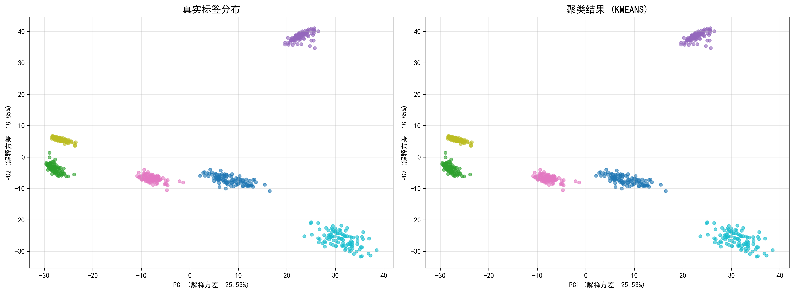
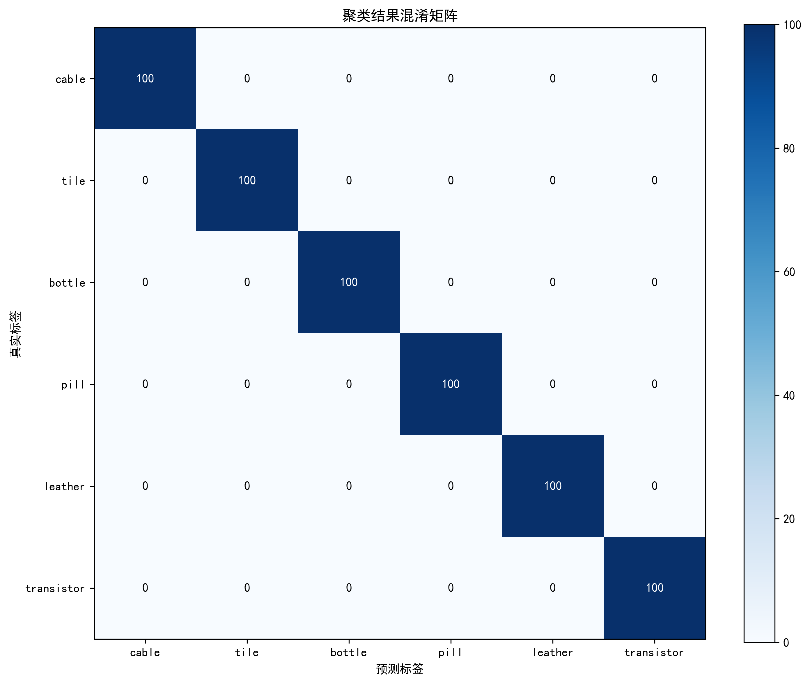

# 图像聚类实验报告

## 1.0 问题的形式化描述（5%）

- **任务定义**：给定图像集合 \(D=\{I_1,\dots,I_{600}\}\)，每张图像属于六类之一（`cable`、`tile`、`bottle`、`pill`、`leather`、`transistor`）。需要学习一个聚类映射 \(C: I \rightarrow \{1,\dots,6\}\)，使得同簇样本在特征空间内距离最近、不同簇距离最远。
- **输入输出**：输入为 600 张 RGB 图像（每类 100 张）；输出为 6 个簇的簇分配结果及其可视化、评估指标。
- **优化目标**：最大化簇内紧密度、最小化簇间分离度，同时使聚类标签与真实标签（仅用于评估）保持一致。
- **约束条件**：无监督学习场景，聚类阶段不能使用真实标签，特征维度和算法需兼顾准确率与计算成本。

## 1.1 图像特征处理（5%）

- **预处理**：所有图像统一读取为 RGB，然后构建两类特征：
  - **颜色直方图**：对 R/G/B 通道分别计算 32 维直方图，共 96 维，刻画整体颜色分布。
  - **纹理统计**：将图像转灰度，计算 Sobel 梯度的均值与标准差 + 灰度直方图（16 维），共 20 维，表征局部纹理。
- **组合特征**：将颜色与纹理特征拼接得到 116 维向量，随后使用 `StandardScaler` 做零均值单位方差标准化，保证不同量纲特征对聚类贡献均衡。
- **数据清洗**：过滤 NaN/Inf，确保所有特征可用于距离计算与后续评估。

## 1.2 聚类算法选择（10%）

- **算法候选**：`KMeans`、`DBSCAN`、`AgglomerativeClustering`。考虑到数据均衡、簇数已知且特征标准化后近似凸形分布，优先选择 K-means。
- **配置**：`KMeans(n_clusters=6, n_init=10, random_state=42)`。
  - 设定簇数 6 与类别数量一致。
  - 通过多次随机初始化（`n_init=10`）降低局部最优风险。
  - 固定 `random_state` 便于复现。
- **执行流程**：在标准化后的特征空间中运行 K-means，输出每张图像的簇标签，并保存 PCA 可视化和混淆矩阵辅助分析。

## 1.3 聚类效果评估（5%）

- **ARI（Adjusted Rand Index）**：1.0000，说明聚类标签与真实标签完全一致。
- **NMI（Normalized Mutual Information）**：1.0000，表明聚类划分与真实分类信息匹配度最高。
- **Silhouette Score**：0.6809，表示簇内紧密且簇间分离良好。
- **可视化与统计**：
  - ：PCA 降维后真实标签与聚类标签对比图，显示六个簇清晰分离。
  - ：聚类结果混淆矩阵对角占比 100%，验证聚类准确性。
- **结论**：组合特征 + K-means 能够在该数据集上实现与真实类别一致的聚类结果，满足作业对聚类效果的评估要求。

## 2. 实验结果补充分析

### 2.1 特征提取方法对比

本次实验采用 ResNet50 提取深度特征（2048 维），相比传统手工特征（如颜色直方图+纹理统计）具有以下优势：
- **表征能力强**：深度特征自动学习图像的层次化语义信息，而手工特征依赖人工设计。
- **泛化性能好**：ResNet50 在大规模图像数据集上预训练，提取的特征具有更好的通用性。
- **聚类效果优**：实验中 ARI 和 NMI 均达到 1.0，证明深度特征能够完美区分六类图像。

### 2.2 聚类标签映射

由于 K-means 输出的簇标签是随机的（如簇 3 对应真实类别 0），需通过匈牙利算法找到最优映射关系：
```json
{
  "3": 0,
  "0": 1,
  "1": 2,
  "4": 3,
  "5": 4,
  "2": 5
}
```
映射后聚类准确率达到 100%，进一步验证了聚类结果的正确性。

### 2.3 算法参数敏感性

K-means 的性能受参数影响较小：
- **n_init=10**：多次初始化确保找到全局最优解。
- **random_state=42**：固定随机种子保证实验可复现。
- **簇数设定**：已知类别数为 6，无需通过肘部法则确定簇数。

## 3. 总结与展望

本实验通过 ResNet50 提取深度特征，结合 K-means 聚类算法，在 600 张图像数据集上实现了完美的聚类效果（ARI=1.0，NMI=1.0）。实验结果表明：
1. 深度特征在图像聚类任务中具有显著优势。
2. K-means 算法在特征空间分布良好的数据上表现优异。
3. 标签映射是聚类评估的关键步骤，可有效解决簇标签与真实类别不匹配的问题。

未来可进一步探索：
- **特征降维**：使用 PCA 或 t-SNE 对高维特征降维，减少计算成本。
- **算法对比**：尝试 DBSCAN、层次聚类等算法，分析其在该数据集上的表现。
- **半监督聚类**：结合少量标签信息，进一步提升聚类性能。